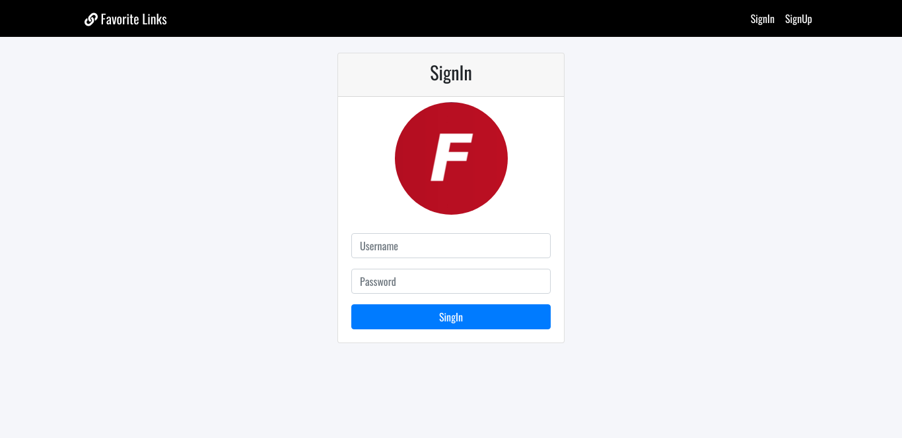

## Descripción

La App “Links Favoritos” es una aplicación de notas, donde los usuarios se registran, inician sesión y pueden almacenar enlaces a páginas de su interés, con títulos y descripciones de dichos enlaces en cada nota creada.

Esta versión está íntegramente en inglés, más que nada para practicar el idioma e integrarlo a mis actividades en el sector TI.

Próximamente, haré la versión en español, agregando más interacciones servidor-usuario, de acuerdo a los conocimientos adquiridos hasta ahora y aquellos que vayaa dquiriendo de ahora en más.

El proyecto fue creado para la Diplomatura Full Stack de Ícaro, en asociación con la Universidad Nacional de Córdoba.

## Aclaración

Algunas de las herramientas utilizadas en la construcción del Proyecto no fueron utilizadas en la práctica a lo largo del Diplomado. Aun así, decidí implementarlos para complementar los conocimientos adquiridos, hasta el momento, en las distintas capacitaciones realizadas, incluyendo las prácticas de la Facultad.

## Primer vistazo

## Instalación

Para aquellos que deseen instalar en su computadora esta pequeña App, los pasos a seguir son los siguientes:

mysql -u MYUSR "-pMYPASSWORD" < ./database/db.sql # create database
npm i
npm run build
npm start

## Estructura de archivos

- base de datos, es la carpeta con todas las consultas sql, la cual se puede usar para recrear la base de datos para esta aplicación;
- src, es todo el código para la aplicación Backend y Frontend;
- documentos.

## Variables de entorno

- PUERTO (PORT)

## Instrumentos

- Handlebars (En reemplazo de HTML)
- CSS
- JavaScript
- Nodejs
- mysql
- Babel
- Docker

Y, ante todo, ¡Muchas gracias!
